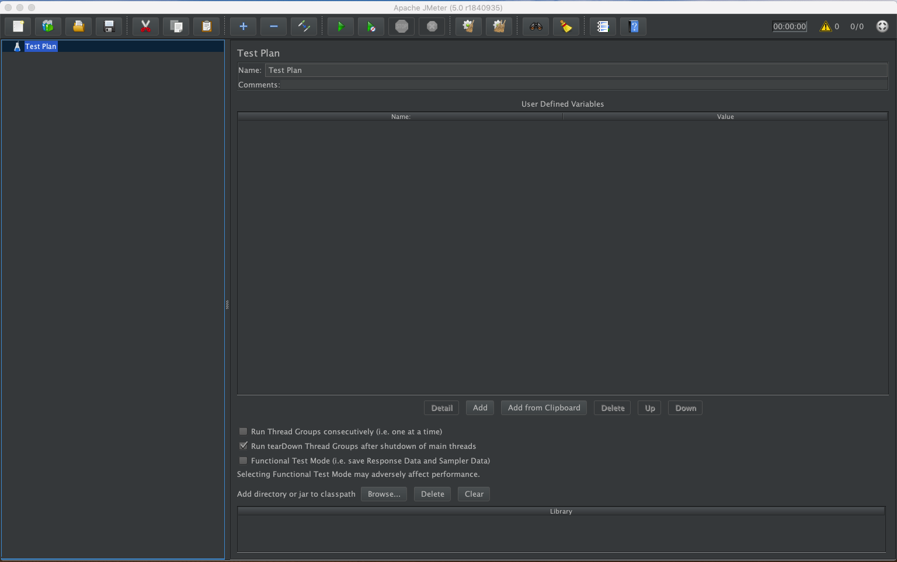

# 了解[JMeter](http://jmeter.apache.org/)

## [JMeter](http://jmeter.apache.org/)是什么

- 开源软件，**纯免费**
- 100%基于[Java](http://www.java.com/)开发的
- 完美的UI界面
- 支持多线程并发测试
- 完善的可视化测试结果
- 各种插件及自定义插件

## [JMeter](http://jmeter.apache.org/)可以用来测试哪些

支持各种**服务及协议**类型

- Web - HTTP, HTTPS
- SOAP / REST
- FTP
- Database
- LDAP
- Message-oriented middleware (MOM)
- Mail
- TCP
- Native commands / shell scripts

# 启动[JMeter](http://jmeter.apache.org/)

## 前提准备

- 安装`Java8`或`更新`的版本，最新版本是`11.0.1`，下载地址：[https://www.oracle.com/technetwork/java/javase/downloads/index.html](https://www.oracle.com/technetwork/java/javase/downloads/index.html)
- 配制完成Java的`环境变量`

验证安装
```
➜  jmeter-tutorial git:(JMeter5.0) ✗ java -version
java version "11.0.1" 2018-10-16 LTS
Java(TM) SE Runtime Environment 18.9 (build 11.0.1+13-LTS)
Java HotSpot(TM) 64-Bit Server VM 18.9 (build 11.0.1+13-LTS, mixed mode)
```

## 安装[JMeter](http://jmeter.apache.org/)

[JMeter](http://jmeter.apache.org/)官方版本是`免安装`的，只需要从官网获取压缩包即可。

- 打开<http://jmeter.apache.org/download_jmeter.cgi>页面
- 下载`Binaries`中的**apache-jmeter-5.0**，tgz或zip格式均可
- 解压下载的压缩包，安装JMeter完成

## 启动[JMeter](http://jmeter.apache.org/)

- 进入解压文件夹的**apache-jmeter-5.0/bin** `目录`
- 三种启动方式，选择适合的即可

  - `MAC`电脑启动

    - 运行`jmeter`

  - `Windows`电脑启动

    - 双击`jmeter.bat`

  - `命令行`启动: `java -jar ApacheJMeter.jar`

- 启动成功后，便可看到[JMeter](http://jmeter.apache.org/)的UI界面



