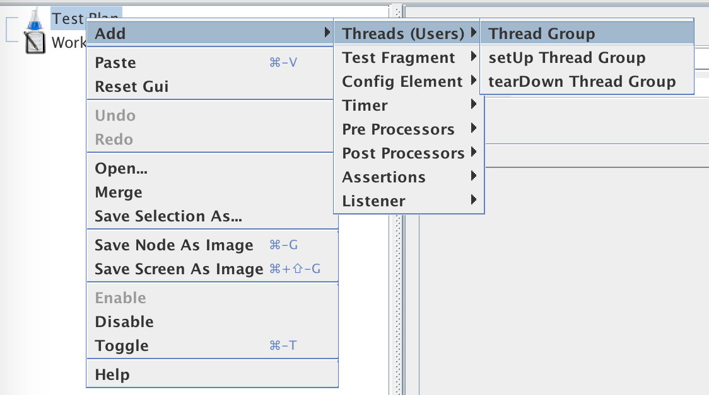
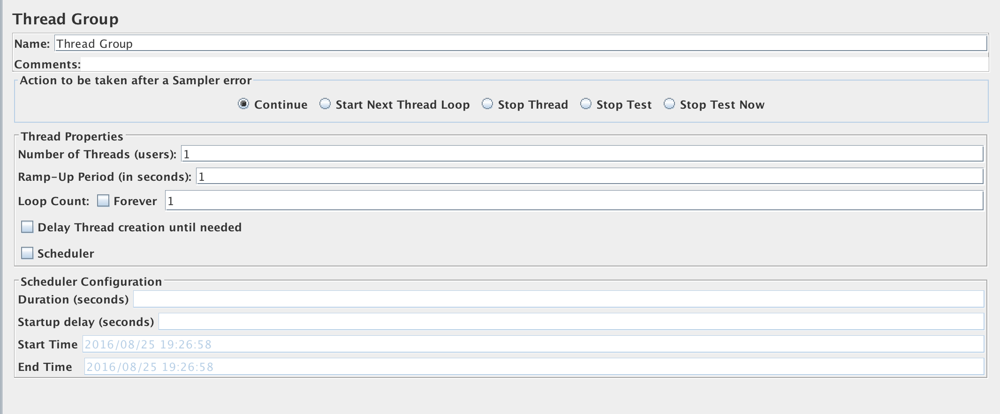
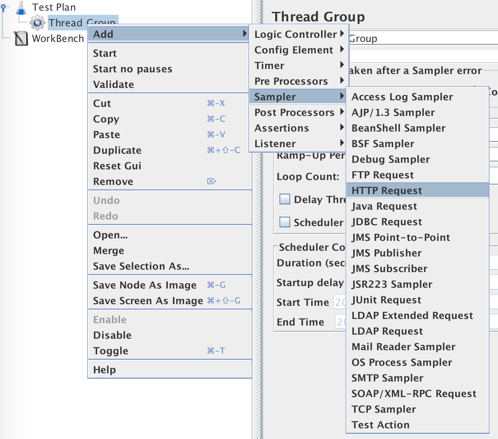
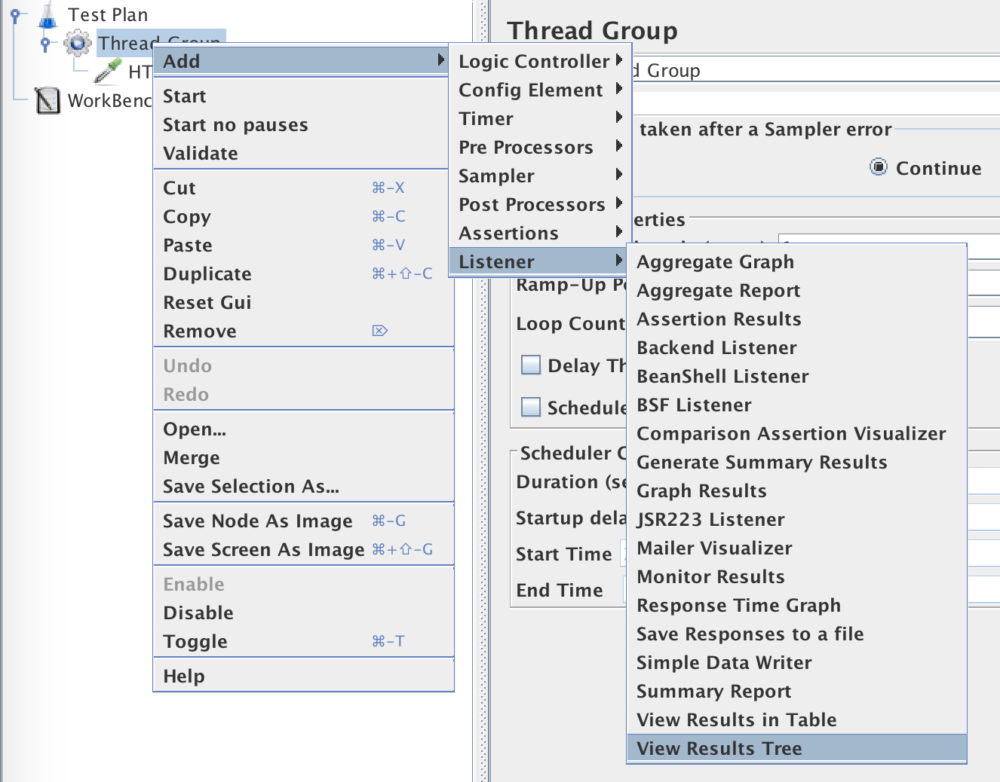
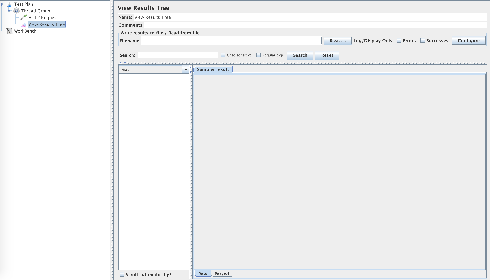
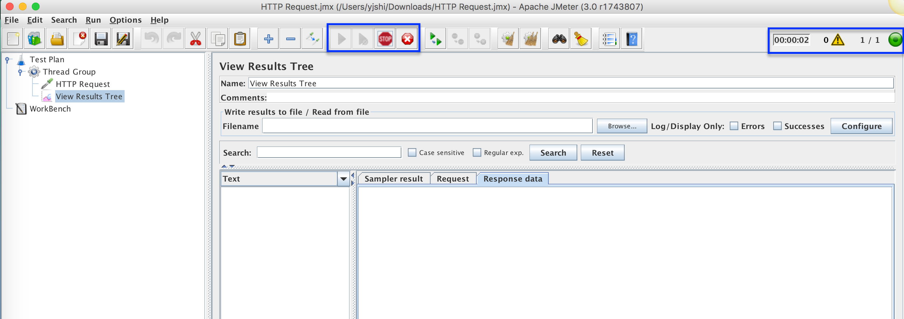
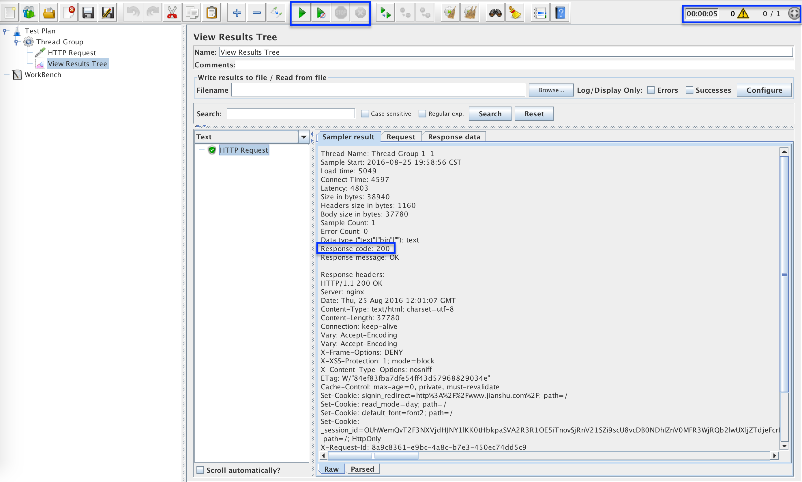

# [JMeter](http://jmeter.apache.org/)语言支持

[JMeter](http://jmeter.apache.org/)支持`英语/法语/德语/挪威语/波兰语/葡萄牙语/西班牙语/土耳其语/日语/中文简体/中文繁体`

## UI语言切换-`简体中文`

- Options -> Choose Language -> Chinese (Simplified)

## 说明

- [JMeter](http://jmeter.apache.org/)的语言包翻译的不够完善，有些功能甚至还是未翻译的。在使用过程中，最好使用默认`英文版本`

# 第一个测试

## 功能说明

- 访问请求<http://www.jianshu.com/>
- 查看返回状态码为200

## 设计测试

### 添加测试计划--Test Plan

在打开JMeter后，会默认有一个空白内容的测试计划。如果没有，点击`功能区`--`New`按钮

### 添加线程组--Thread Group

- 右键点击`Test Plan`，选择`Add`-`Threads(Users)`-`Thread Group`

  

- 在`实现区`会出现线程组的**实现**配制

  

### 添加HTTP请求--HTTP Request

- 右键点击`Thread Group`，选择`Add`-`Sampler`-`HTTP Request`

  

- 在`实现区`会出现HTTP请求的**实现**配制

- 配制HTTP的`Basic`属性中的`Server Name or IP`:`www.jianshu.com`

  

### 添加结果查看--Result Tree

- 右键点击`Thread Group`，选择`Add`-`Listener`-`View Results Tree` 
- 在`实现区`会出现Result Tree的**实现**配制，此处暂时不用做任何配制

  

_测试设计完成，保存`Test Plan`_

## 执行测试

- 点击`功能区`中的`Start`按钮后，可看到`Start`按钮被禁灰/`Stop``Shutdown`按钮进入可点击状态
- `过程区`会显示执行测试的过程数据

  

- 执行结束后，在`Result Tree`会显示本次的测试结果。点击`Result Tree`中的`HTTP Request`，此时会显示出本次`请求`的结果明细

  

  - 返回状态码Response Code:200

_至此，第一个`JMeter`的测试请求完成。_

完整的源文件存放于[HTTPRequest.jmx](../src/chapter1/HTTP Request.jmx)
