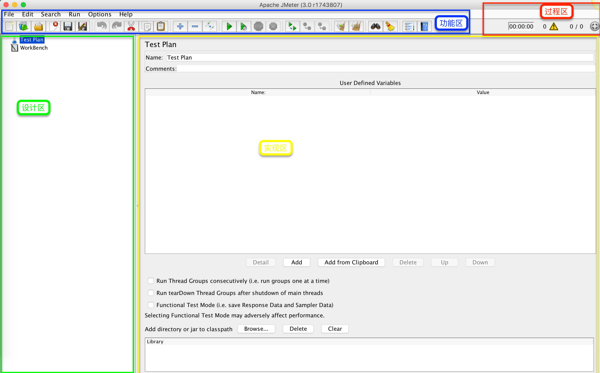
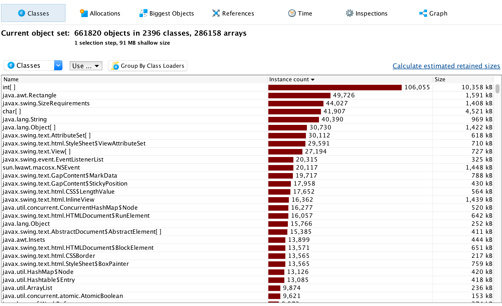

## [JMeter](http://jmeter.apache.org/)目录分析

```
.
├── LICENSE //协议文件
├── NOTICE  //JMeter软件信息
├── README  //软件介绍
├── bin //启动 关闭 配制 示例相关
├── docs  //参考文档
├── extras  //
├── lib //引用的jar包
├── licenses  //引用的第三方包的license说明
└── printable_docs  //可打印的文档
```

目录及对应的文件的使用，在后续内容中会详细讲解。

## 界面



### 功能区
主要用于界面样式/启动/运行配制相关。

#### 菜单区

* File: 文件操作/保存等，如：新建测试计划/保存测试计划
 * Open: 打开一个已有的`测试计划`
 * Templates: 使用已有的`模板`，快速创建`测试计划`
 * Merge: 将当前打开的测试计划与目标测试计划合并
* Edit: 测试计划的编辑，如：新增请求/添加监听器。内容依据选择的`节点`不同而变化
 * Add: 依据当前选中的节点，进行添加新节点操作
 * Reset GUI: 重置当前`实现区`的配制内容
 * Enable/Disable: 启用/禁用选中的节点
* Search: 计划中内容查找
  * Search: 搜索节点名
  * Reset Search: 清空Search结果
* Run: 执行测试，如：本地执行/远程执行
 * Start*: 执行本地的测试计划
 * Remote*: 远程操作
 * Clear: 清空当前选中的执行结果
 * Clear All: 清空所有的执行结果
* Options: 样式/展示效果设置
 * Function Helper Dialog: 弹出方法的帮助说明，可查看具体的使用
 * Look and Feel: 样式选择
 * Log Viewer: 执行测试计划过程中的日志显示选项，勾选时，显示执行过程中的日志内容
 * SSL: 选择执行过程中所需要的SSL加密文件
 * Choose Language: 评论选择
 * Collapse/Expand all: 收起/展开所有的节点
* Help: 帮助相关
 * Help: 直接打开当前`实现区`的帮助内容，并定位到对应的位置
 * What's this node?: 定位到当前节点在`设计区`的位置
 * Enable/Disable debug: 开启/关闭Debug模式
 * Create a heap dump: 创建当前程序的Dump文件，用于查看资源的使用情况
 

#### 快速操作区

将`菜单区`中常用的功能拉到下面，看提示信息就能看懂啦

### 设计区
* 测试计划如何配制
* 测试用例如何设计
 - 测试前提准备
 - 测试步骤
 - 测试结果验证
* 测试场景如何组装
* 测试结果如何查看

### 实现区

针对`设计区`的内容进行细节的配制及实现。如：测试结果的验证/测试步骤的执行

### 过程区

测试过程中的数据展示，执行时间/错误数
