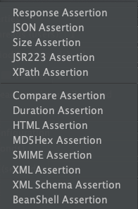
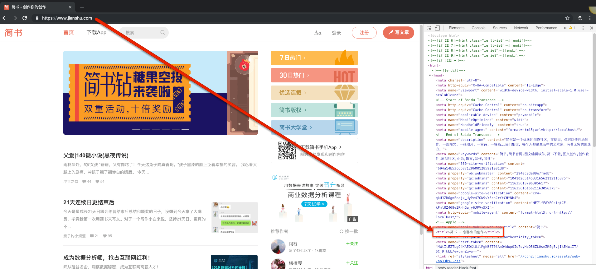
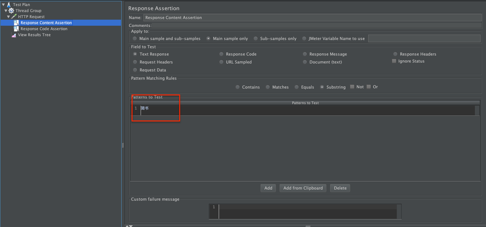
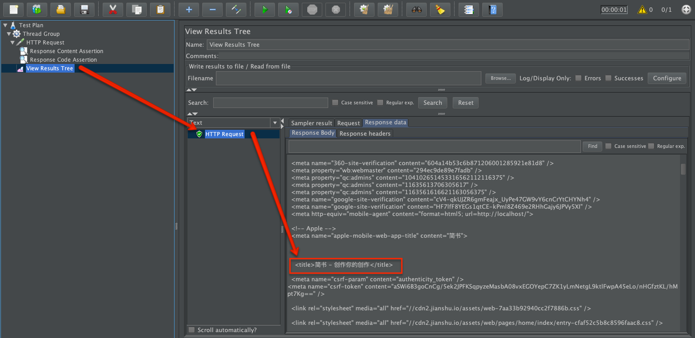
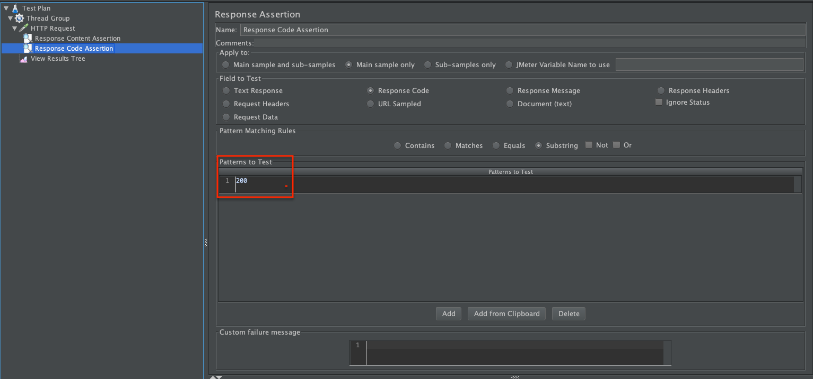
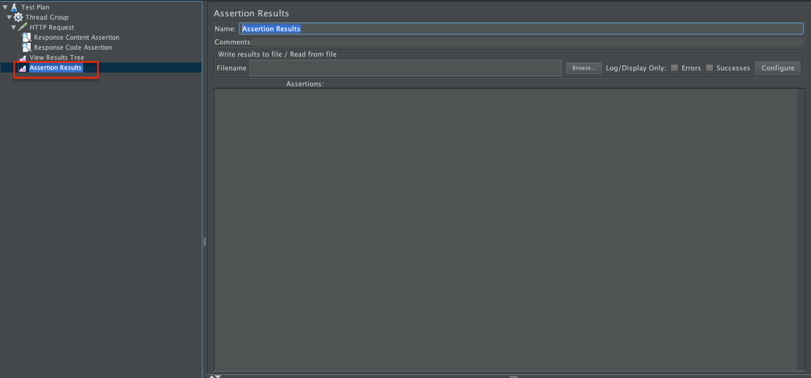
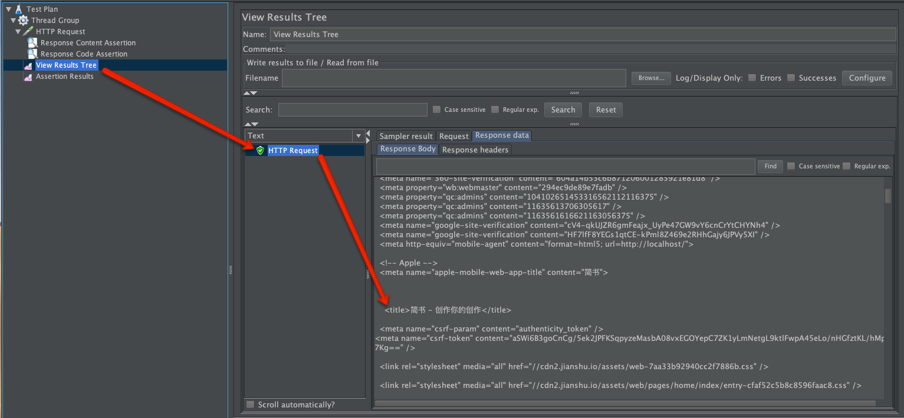
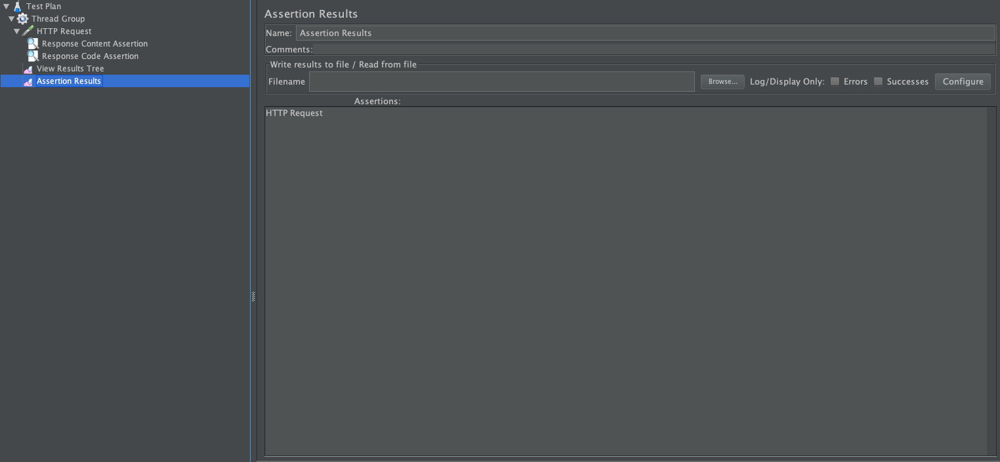

# 断言测试

`断言`，对结果的判断。如: 响应时间/返回状态码。

## [JMeter](http://jmeter.apache.org/)丰富的断言支持

关于`Assertion`的使用，仅会挑选使用频率较高的进行详细说明。[JMeter](http://jmeter.apache.org/)自带了`12`种断言方式。

- `BeanShell Assertion`
- `BSF Assertion`
- `Compare Assertion`
- `Duration Assertion`: 持续时间断言，主要用于响应时间的判断
- `HTML Assertion`
- `JSR223 Assertion`
- `MD5Hex Assertion`
- `Response Assertion`

  - `Apply to`: 判断的范围选择，一般选择`Main sample only`

    - `Main sample and sub-samples`: 主样例和子样例
    - `Main sample only`: 仅主样例
    - `Sub-samples only`: 仅子样例
    - `JMeter Variable`: `JMeter`的变量

  - `Response Field to Test`: 需要测试的内容，一般选择`Text Response`/`Response Code`和`Response Header`

    - `Text Response`: 文件格式的返回内容，不包括返回的信息头
    - `Document(text)`: 文档
    - `URL Sampled`: URL样例
    - `Response Code`: 返回的状态码
    - `Response Message`: 返回信息
    - `Response Header`: 返回的信息头
    - `Ignore Status`: 忽略状态码

  - `Pattern Matching Rules`: 匹配规则，一般选择`Substring`

    - `Contains`: 包含
    - `Matches`: 匹配
    - `Equals`: 等于
    - `Substring`: 子字符串
    - `Not`: 没有

  - `Patterns to Test`:真正需要匹配的`测试内容`，可通过下方的`Add` `Delete`按钮来维护。

- `Size Assertion`: 返回内容`大小`断言，可针对整个响应/响应头/响应数据体/响应信息进行判断

- `SMIME Assertion`: 主要用于邮件读取时的判断
- `XML Assertion`: 判断是否返回正确的`XML`格式内容
- `XML Schema Assertion`: 判断响应的内容与目标`XML`文件是否一致
- `XPath Assertion`: 判断返回内容中的`XPath`路径

## 使用`断言`实例：返回请求`Title`中包含指定内容 + 返回请求状态码验证

### 访问<http://www.jianshu.com/>验证返回信息中是否包含`简书`

- 正常访问<http://www.jianshu.com/>查看是否在返回信息中存在`简书` 

- 使用`HTTP Request` + `Response Assertion` + `Result Tree` 

- 运行测试，查看结果，测试通过 

### 追加对返回`状态码`的验证，提高测试的准确性

- 添加一个新的`Response Assertion` 
- 添加`Assertion Results`，查看所有断言的执行情况

- 执行测试，查看测试结果 

