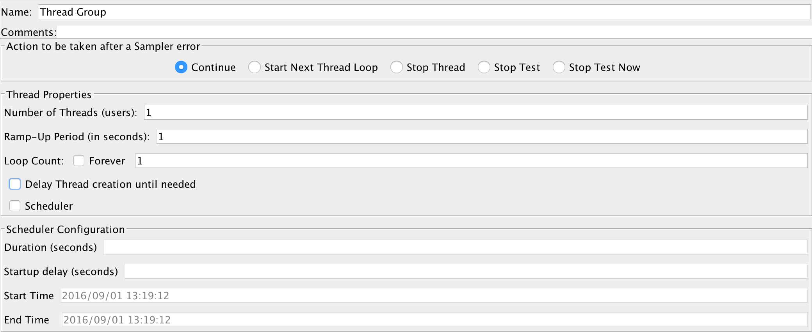

# 线程高并发

测试过程中，往往需要提高测试的并发数量，使用[JMeter](http://jmeter.apache.org/)可很快速的完成此功能。

## 线程组分类
* `setUp Thread Group`
启动线程组，主要用于在执行测试前的一些工作。如清除数据/注册账号。

* `Thread Group`
真实执行的测试线程组。实现性能测试所需要的所有内容。

* `tearDown Thread Group`
销毁线程组，主要用于测试结束后的收尾工作。如清除测试脏数据/环境还原。

## 配制线程组

* `name`: 用户线程组的命名
* `Comments`: 线程组的功能的备注，可为空
* `Action to be taken after a Sampler error`: 样式错误后采取的方案
 * `Continue`: 继续执行
 * `Start Next Thread Loop`: 结束当前Thread，直接开启下一个新的线程
 * `Stop Thread`: 停止线程
 * `Stop Test`: 在当前样例结束后，停止测试
 * `Stop Test Now`: 马上`强制`停止测试
* `Thread Properties`: 线程属性
 * `Number of Threads(users)`: 需要模拟的用户/线程数
 * `Ramp-Up Period(in seconds)`: [JMeter](http://jmeter.apache.org/)多久将所有的线程启动。
 * `Loop Count`: 循环数
    * `Forever`: 选择后，测试只能通过`手工`停止;否则会一直执行
    * 配制具体的循环数
 * `Delay Thread creation until needed`: 此选择仅在`Thread Group`中有。延迟线程仅在需要的时候创建
 * `Scheduler`: 勾选后，才可配制以下内容
  * `Duration(seconds)`: 测试持续时间
  * `Startup delay(seconds)`: 开始延迟时间
  * `Start Time`: 指定测试开始时间
  * `End Time`: 指定测试结束时间

## 使用

测试过程中，需要有效的提升[JMeter](http://jmeter.apache.org/)`并发`，主要围绕在`Number of Threads(users)`/`Ramp-Up Period(in seconds)`/`Loop Count`的配制中。
