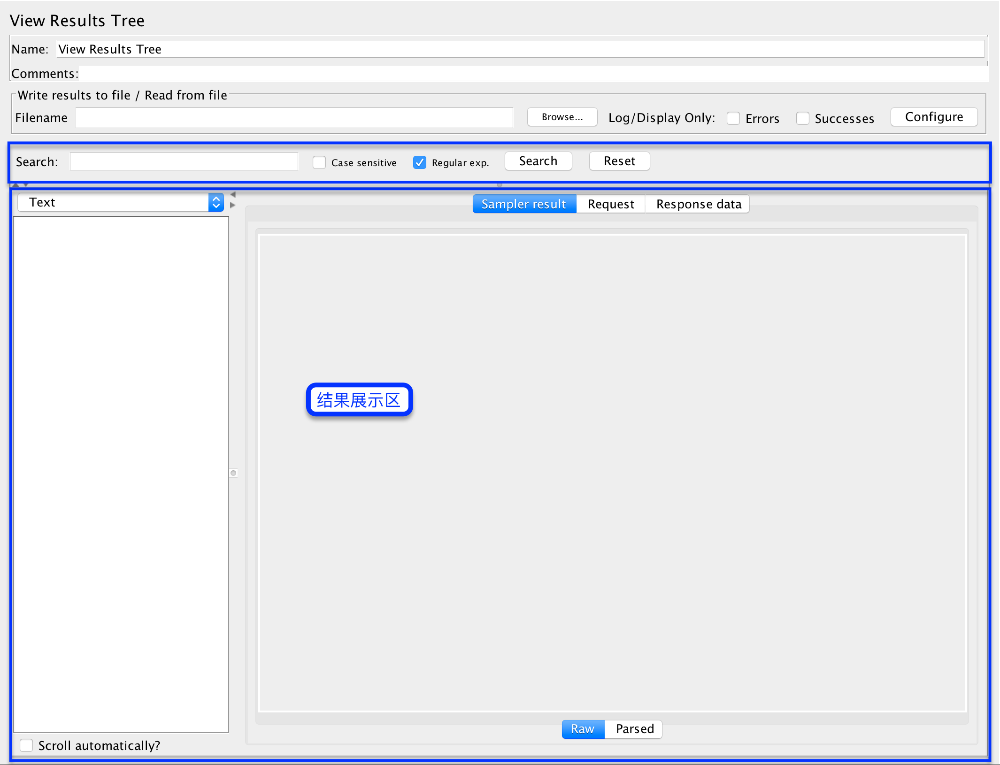
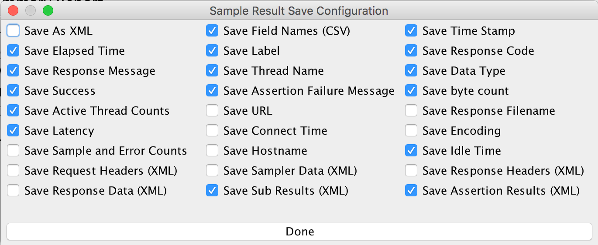
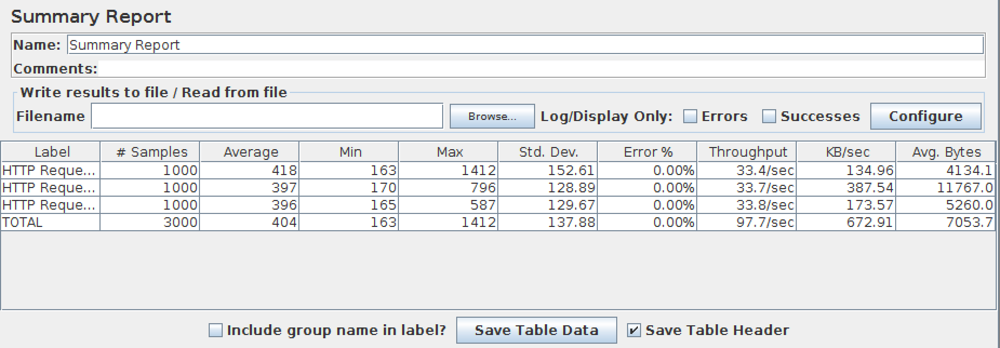
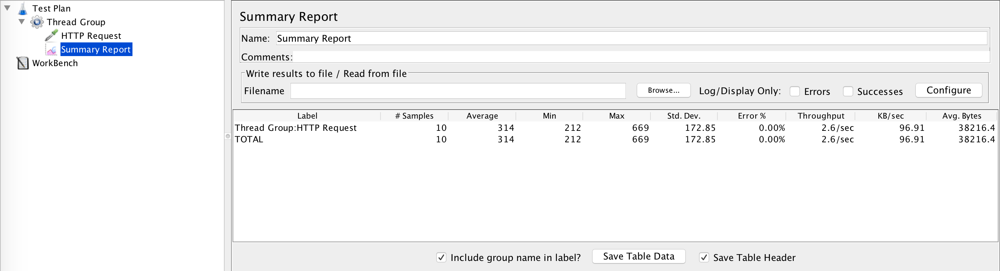

# Result Tree

主要用于结果的测试执行结果的展示，会展示样例的`结果`/`请求信息`/`返回信息`。

## 配制说明

- `Write results to file / Read from file`: 写结果到文件或读取文件内容

  - `File`: 需要加载的文件
  - `Log/Display Only`

    - `Errors`: 仅显示错误
    - `Successes`: 仅显示成功的部分
    - `Configure`: 需要配制保存的字段 

- `Search`: 快速搜索样例名

  - `Case sensitive`: 启用大小写敏感搜索
  - `Resgular exp.`: 启用正则表达式搜索
  - `Search` `Reset`: 搜索/重置按钮

- `结果展示区`

  - `Text`: 文件样式查看样例结果，可通过下方的`Raw` `Parsed`来切换展示方式。
  - `RegExp Tester`: 正则表达式针对返回结果的调试器
  - `CSS/JQuery Tester`: `CSS/JQuery`的调试器
  - `XPath Tester`: `XPath`调试器
  - `HTML`: `HTML`文件形式查看，`不会下载任何页面中的资源`
  - `HTML(download resources)`: 下载页面资源，再以`HTML`样式展示，但样式不会使用
  - `Document`: 主要用于有外部文件时，展示页面的结果。如:Word/Excel文件。
  - `JSON`: 以`JSON`数据格式展示
  - `Scroll automatically?`: 勾选后，在测试过程中会自动滚动结果树中的展示，以及时展示最新的测试结果

## 应用

- `调试器`可用于在返回内容中提取`变量`，如: 用户名
- 在性能测试时，`结果树`一定要取消，因为它会占用大量的资源(内存和CPU)。

# Summary Report

主要用于`实时`测试结果的汇总查看，如: 请求时间/错误率/吞吐量/平均请求字节数

## 配制说明

- `Write results to file / Read from file`

  - `Filename`: 选择需要加载或保存测试结果的文件
  - `Log/Display Only`

    - `Errors`: 仅显示有错误的结果
    - `Successes`: 仅显示成功的结果
    - `Configure`: 配制需要保存的字段数据 

- 展示的结果区域

  - `Label`: 展示测试过程中所有执行的请求和控制器的`聚合`
  - `# Samples`: 样例执行数量
  - `Average`: 平均时间，单位: ms
  - `Min`: 最小时间，单位: ms
  - `Max`: 最大时间，单位: ms
  - `Std. Dev.`: [Standard deviation](https://en.wikipedia.org/wiki/Standard_deviation)标准的偏移量
  - `Error %`: 错误率
  - `Throughput`: 服务每秒处理的请求数据量
  - `KB/sec`: 自身的吞吐量
  - `Avg. Bytes`: 响应的平均大小

- `Include group name in label`: 在`Label`中添加组名显示
- `Save Table Data`: 保存`结果区域`数据至`CSV`

  - `Save Table Header`: 保存数据时，是否保存表头。如: Label/# Samples

## 应用

- 测试整体计划的调试: 执行次序/错误率/吞吐量
- 测试结果的保存与展示
