# 逻辑控件器

**请求过程中，需要一些逻辑处理的控制器。如: 用户必须是登录成功后，才可访问个人信息页面**

## Critical Section Controller

## Foreach Controller
* 遍历变量中的所有值
* 应用场景: 遍历变量的所有值。如:获取用户ID列表，再依次查看用户用户信息
* 配制说明
 * `Input variable prefix`: 需要遍历的变量
 * `Start index for loop(exclusive)`: 从哪个索引开始，不填表示从第一个元素开始
 * `End index for loop(inclusive)`: 从哪个索引结束，不填表示遍历至变量内容的最后一个元素
 * `Output variable name`: 遍历出来结果的变量，在控制器中使用的变量名
 * `Add "_" before number ?`: 在数字前添加`_`，默认勾选。如果是使用`JMeter`的正则表达式提取的变量，刻要勾选此项
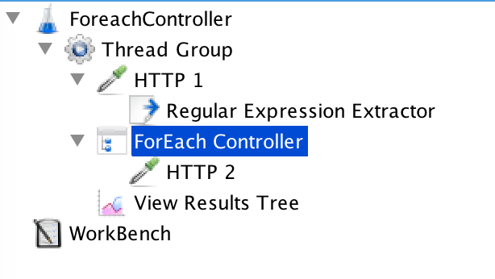
* 示例参考: [ForEachController.jmx](../src/chapter2/ForEachController.jmx)

## If Controller
* `If`状态判断控制器
* 配制说明
 * `Condition(default Javascript)`: `If`的判断条件，默认支持`Javascript`语法
 * `Interpret Condition as Variable Expression?`: 勾选后，表达式的结果要为`真`时，才算判断成功。
 * `Evaluate for all children?`: 是否对所有的子控制器进行校验
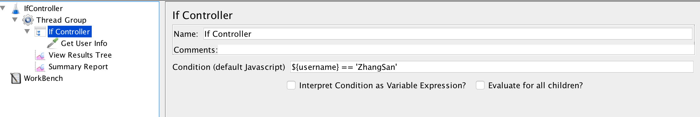
* 示例参考:  [IfController.jmx](../src/chapter2/IfController.jmx)

## Include Controller
* 引用外部`测试计划`控制器
* 应用场景: 测试过程中，需要引用外部的`测试计划`
* 配制说明
 * `Include Test Plan-Filename`: 选择需要引入的外部测试计划文件
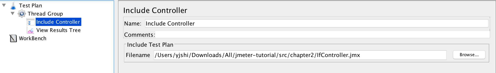
* 示例参考: [IncludeController.jmx](../src/chapter2/IncludeController.jmx)

## Interleave Controller
* 间隔控制器，每个`线程`用户仅执行一次控制器内的请求，`线程`用户依据循环的次数请求控制器中的请求数
* 配制说明
 * `ignore sub-controller blocks`: 是否忽略子控制器
 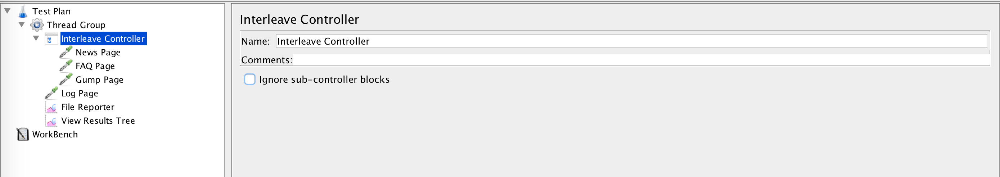
* 示例代码: [Interleave.jmx](../src/chapter2/Interleave.jmx)

## Loop Controller
* 循环控制器
* 应用场景: 指定循环次数或无限次循环
* 配制说明
  * `Loop Count`: `Forever`勾选后，则控制器一直循环;不勾选时，可直接设置循环的`次数`
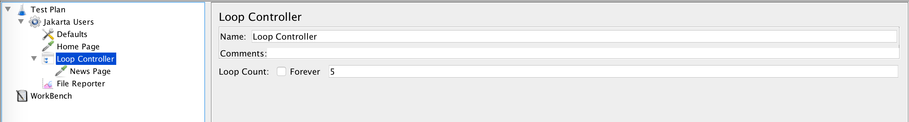
* 示例代码: [LoopController.jmx](../scr/chapter2/LoopController.jmx)

## Module Controller
* 模块控制器，用于跳转到`选定`的控制器位置并执行对应的`控制器`
* 应用场景: 业务逻辑的跳转
* 配制说明
  * `Module to Run`: 选择需要跳转到的目标控制器
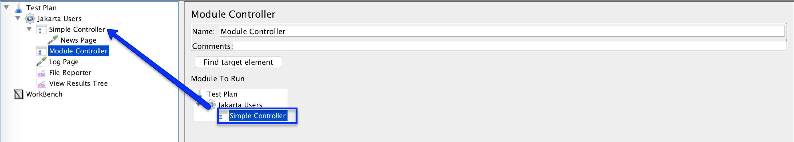
* 示例代码: [ModuleController.jmx](../scr/chapter2/ModuleController.jmx)

## Once Only Controller
* 每个`线程`用户仅运行一次
* 应用场景: 在`线程`中仅需要运行一次，后续不需要再次运行。如: 创建用户
* 配制说明
  * 控制器不额外配制，将需要`执行一次`的内容放到控制器内，即可
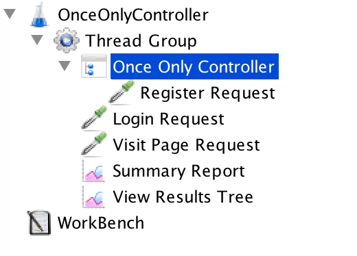
* 示例参考: [OnceOnlyController.jmx](../src/chapter2/OnceOnlyController.jmx)

## Random Controller
* 随机控制器，随机选择控制器中的请求进行执行
* 应用场景: 页面的随机访问
* 配制说明
 * `ignore sub-controller blocks`: 忽略子控制器
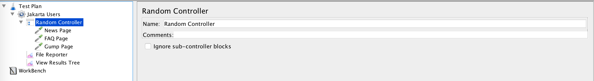
* 示例代码: [RandomController.jmx](../src/chapter2/RandomController.jmx)

## Random Order Controller
* 随机顺序执行，与`Random Controller`不同的是，这个控制器会先将需要随机的内容均执行一遍，但次序不定
* 应用场景: 页面的随机访问,但均需要访问，且次序不限
* 配制说明
 * `ignore sub-controller blocks`: 忽略子控制器
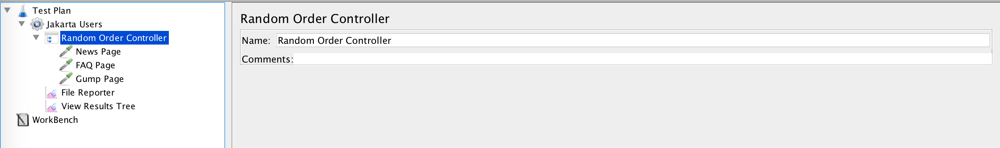
* 示例代码: [RandomOrderController.jmx](../src/chapter2/RandomOrderController.jmx)

## Recording Controller
* 录入控制器，直接使用JMeter的代理来录入`浏览器`的请求信息
 * 录入时，需要设置浏览器的`代理地址及端口`
* 应用场景: 针对浏览器的请求信息进行`录入`
* 配制说明
  * `Recording Controller`自身不需要配制，但需要`HTTP(S) Test Script Recorder`和`HTTP Request Defaults`的配制
  * `HTTP Request Defaults`: 配制`Web Server-Server Name or IP`中配制需要录入的`目标地址`的根URL
  * `HTTP(S) Test Script Recorder`
    * `Port`: 代理所需要使用的端口号
    * `Test plan content--Target Controller`: 录入内容需要存放的位置
    * `Test plan content--Grouping`: 录入内容的分组策略
    * `URL Patterns to Include`: 过滤需要录入的URL地址，支持正则表达式
    * `URL Patterns to Exclude`: 过滤不需要录入的URL地址，支持正则表达式
    * 设置浏览器的代理地址及端口，点击`HTTP(S) Test Script Recorder`下方的`Start`后，在浏览器中输入地址，即可开始录入    
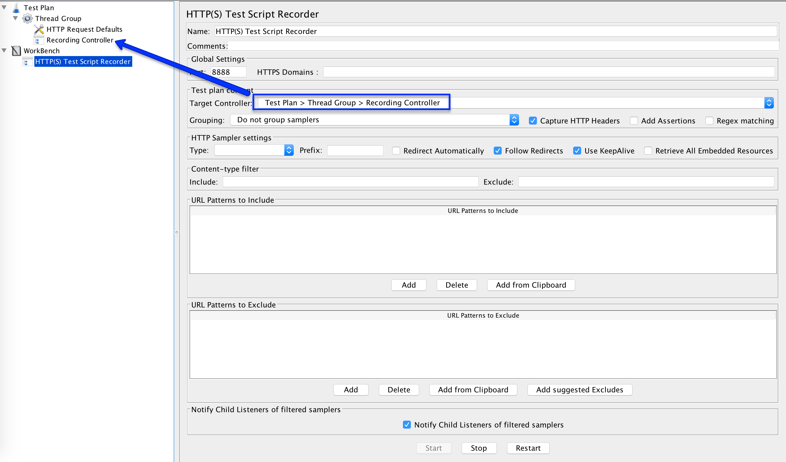
* 示例代码: [RecordingController.jmx](../src/chapter2/RecordingController.jmx)

## Runtime Controller
* 运行时间控制器，设置控制器中的请求运行时间，单位：`秒`
* 应用场景: 对业务请求时间进行限制
* 配制说明
 * `Runtime(seconds)`: 配制需要设置的运行时间，单位`秒`
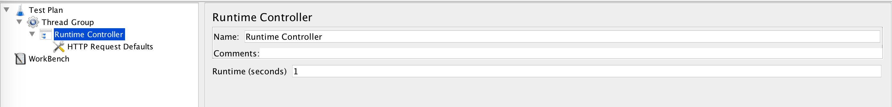
* 示例代码: [RuntimeController.jmx](../src/chapter2/RuntimeController.jmx)

## Simple Controller
* 简单控制器，不提供**任何**`逻辑功能`
* 应用场景: 请求的管理
* 配制说明
 * 此控制器不需要配制
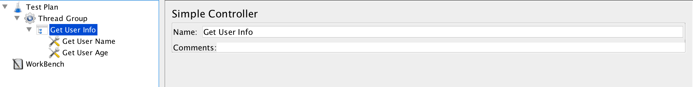
* 示例代码: [SimpleController.jmx](../src/chapter2/SimpleController.jmx)

## Switch Controller
* 跳转控制器，类似编程语言中的`Switch`语法功能
* 应用场景: 满足条件执行的控制器
* 配制说明
  * `Switch Value`: 配制需要跳转第几个的元素，元素值从0开始
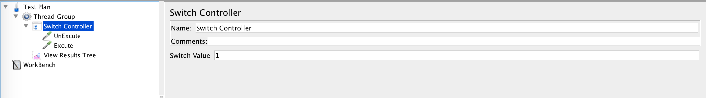
* 示例代码: [SwitchController.jmx](../src/chapter2/SwitchController.jmx)

## Throughput Controller

## Transaction Controller
## While Controller
