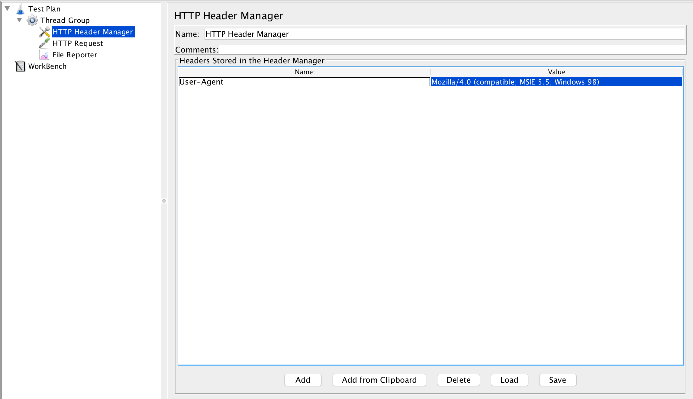
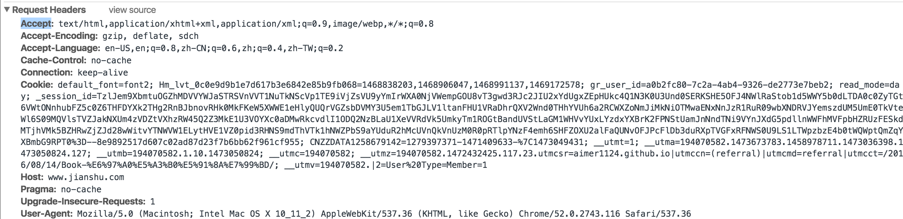
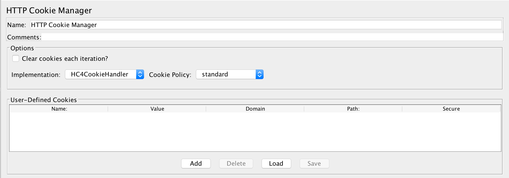

# HTTP信息头管理

用于`添加` `重写`HTTP请求的头信息。如：`User-Agent` `Accept-Encoding`

## 配制说明

* `Headers Stored in the Header Manager`: 用于配制`HTTP`请求时的头信息
  * `Name`: 头信息的`属性名`
  * `Value`: 头信息的`属性值`
* 示例代码: [HeaderManager.jmx](../src/chapter3/HeaderManager.jmx)

## 应用

以上`Request Headers`中的内容均可使用`HTTP Header Manager`来模拟，下面简要说明部分使用。

* 使用`User-Agent`来模拟不同的的客户端发起的请求，如: 手机端/指定浏览器版本
* 使用`Accept`来模拟文件格式
* 使用`Cookie`中的配制来模拟发送请求中的`Cookie`信息，使用`HTTP Cookie Manager`可进行较为复杂的`Cookie`管理和维护

# HTTP Cookie管理器

* 可以像浏览器一样`存储` `发送`Cookies。
* 手动管理和维护`Cookies`中的内容。

## 配制说明

* `Options`
  * `Clear cookies each iteration?`: 勾选后，每次`线程组`的循环均会清空`Cookie`，但`自定义`的不会被清空
  * `Implementation`: 选择需要继承的HC4CookieHandler(HttpClient 4.5.X API)/HC3CookieHandler(HttpClient 3 API)，可使用默认
  * `Cookie Policy`: 先找`Implementation`的具体策略，可使用默认
* `User-Defined Cookies`: 用户自定义Cookie
  * `Name`: Cookie的`属性名`
  * `Value`: Cookie的`属性值`
  * `Domain`: 作用域，对于有`作用域`要求的
  * `Path`: 域路径
  * `Secure`: 安全性，可使用默认不勾选

## 应用

* 业务需求需要在每次执行时清空`Cookie`时，可勾选`Clear cookies each iteration?`
* 指定`Cookie`内容,可在`User-Defined Cookies`添加自定义的Cookie
