# 实战性能测试

## 目的

- 学习使用JMeter工具，实现针对Web项目URL的并发请求，完对结果进行整理及分析。
- 找出性能测试的`三步曲`

## 使用技术点

### 清单

- `HTTP Request`: 发送HTTP请求
- `ForEach Controller`: 循环处理
- `Response Assertion`: `Response`断言
- `Regular Expression Extractor`: 正则表达式提取器
- `Debug Sampler`: 调试样例
- `RegExp Tester`: 正则表达式测试
- `View Results Tree`: 查看结果树
- `Assertion Results`: 断言结果
- `Summary Report`: 概要报告

## 实例

### 需求: 查看简书首页所有文章链接的访问时间

### 拆分

- 只有实时通过获取`简书首页`内容，才能获取`首页`中`所有文件章`链接
- 通过使用`文章`链接的访问，才能达到测试访问时间的目的
- 对获取`文章页`的状态码进行校验

### 调试

#### Step1: 获取文章内容

- 添加`HTTP Request`，来获取`简书`首页内容 
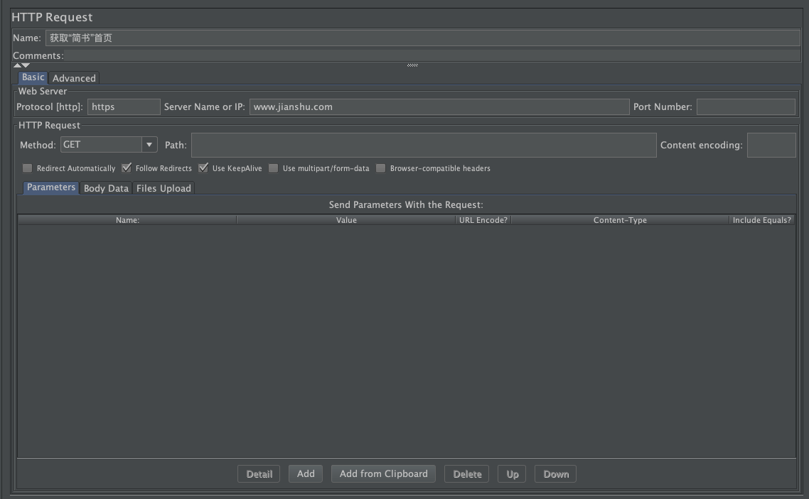

- 添加`Result Tree`，来查看运行结果。执行测试，查看结果: **可正常请求，并返回状态码 `200`** 
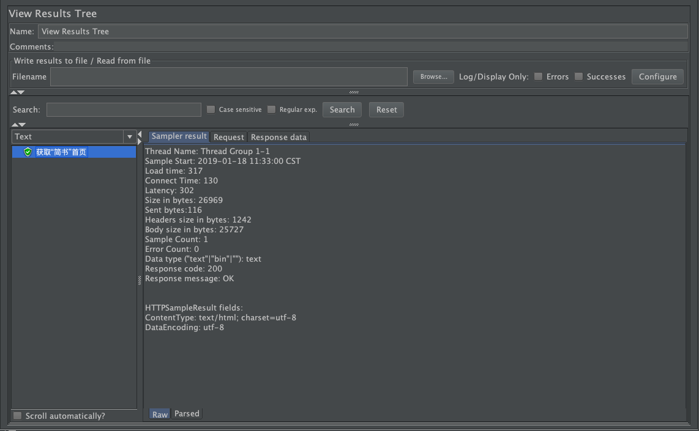

#### Step2: 对获取的内容进行分析，找到需要匹配的部分

- 使用`Result Tree`中的结果，分析返回数据格式

  - 返回的所有文章均在`<ul class="note-list" infinite-scroll-url="/">`中，且每个文章均被存放在元素`li`中

  ```
    <li id="note-36654059" data-note-id="36654059" class="have-img">
        <a class="wrap-img" href="/p/7546d40a7a02" target="_blank">
          
        </a>
      <div class="content">
        <a class="title" target="_blank" href="/p/7546d40a7a02">每天三件事，开启高效人生</a>
        <p class="abstract">
          时间管理其实就是一门分配精力的艺术 很多人不能早起的原因在于，没有什么能让他早起感到兴奋，即便是早起了也不知道做什么事可以让生活变得有价值和意义...
        </p>
        <div class="meta">
          <a class="nickname" target="_blank" href="/u/353d1d951f03">邵筅笙Finish</a>
            <a target="_blank" href="/p/7546d40a7a02#comments">
              <i class="iconfont ic-list-comments"></i> 6
    </a>      <span><i class="iconfont ic-list-like"></i> 82</span>
        </div>
      </div>
    </li>
  ```

  - 文章的标题及链接被存放在`<a class="title" target="_blank" href="/p/7546d40a7a02">每天三件事，开启高效人生</a>`中
  - `a`标签中的`href`值: `/p/7546d40a7a02`
  - 访问[www.jianshu.com/p/7546d40a7a02](www.jianshu.com/p/7546d40a7a02)可正常打开文章`每天三件事，开启高效人生`的页面内容

- 只需要将所有文章元素中的`href`提取出来，再将`www.jianshu.com`的添加上，便可完成对`所有文章`请求的链接`拼装`

#### Step3: 对返回内容结果进行调试，找出正则表达式

- 使用`Result Tree`中的`RegExp Tester`调试，最终达到提取文章`href`内容。
- 最终的正则表达式为 
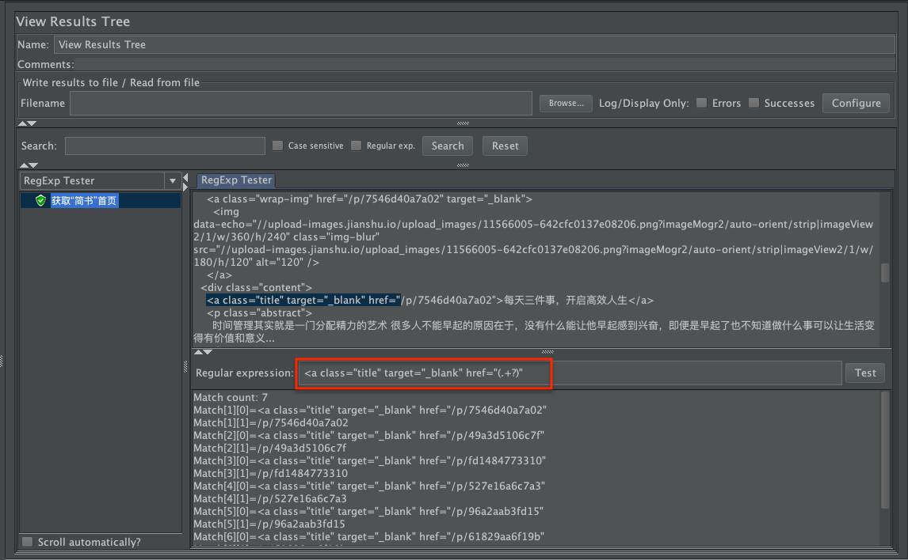

  ```
  <a class="title" target="_blank" href="(.+?)"
  ```

#### Step4: 添加正则表达式提取器，提取获取内容

- 添加`Regular Expression Extractor`来提取首页中获取的每个文章的`href`值，并返回给变量`articleLink` 
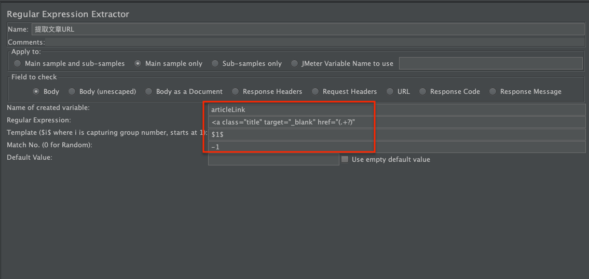
- 添加`Debug Sampler`查看`正则表达式`提取的结果是否正确，使用默认配制即可
- 再次运行测试，查看`Result Tree`中查看`Debug Sampler`的结果 
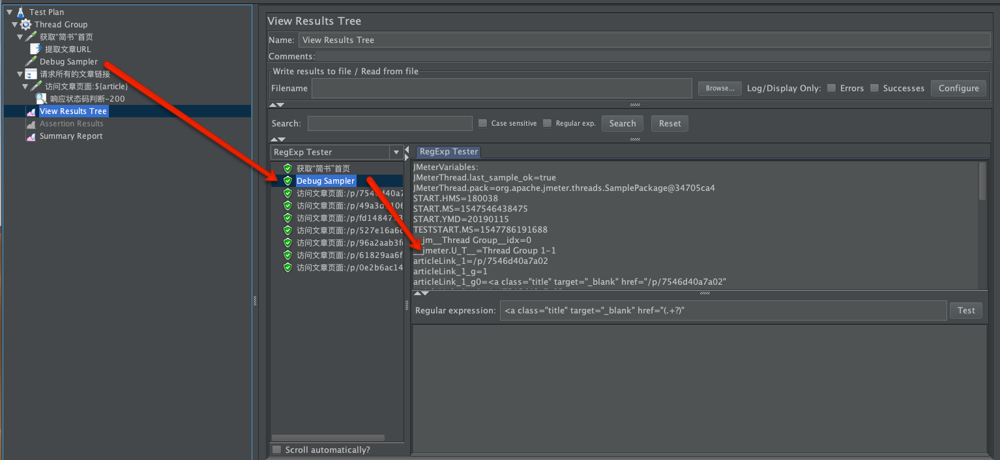
- 至此，提取文章`href`值的内容已经完成，禁用/删除`Debug Sampler`

#### Step5: 获取所有文章内容

- 使用`ForEach Controller`完成对获取内容进行处理。输入`articleLink`，返回`article` 
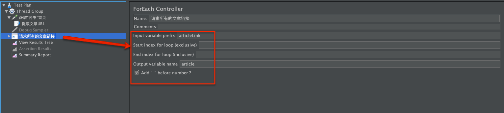
- 在`ForEach Controller`内，添加请求文章页面的`HTTP Request`，并将变量`article` `拼装` 至请求中 
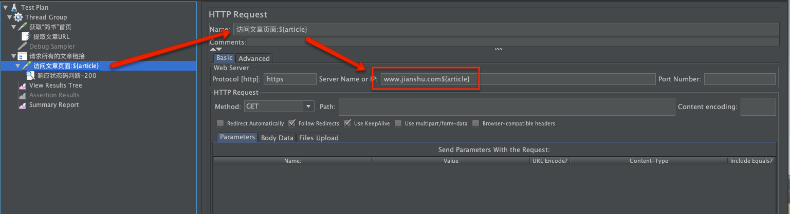

- 再次执行测试，查看`Result Tree`中的测试结果 
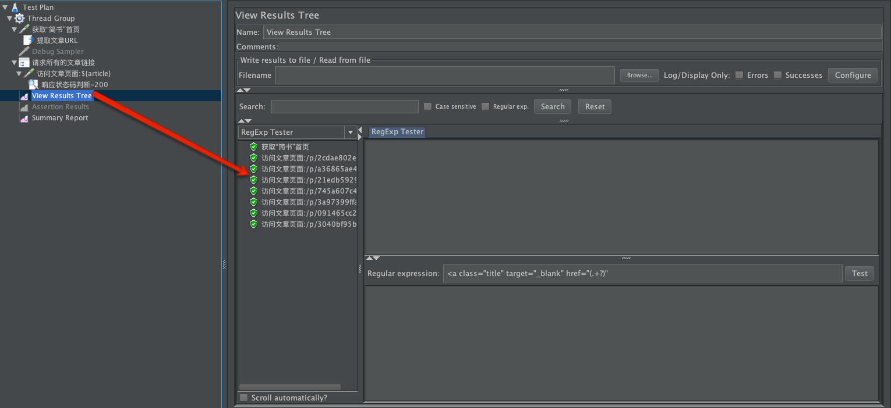

#### Step6 添加对访问文章页面正确性的验证: 状态码200

- 在请求文章内容页面内，添加`Response Assertion`，校验返回的状态码是否为200 
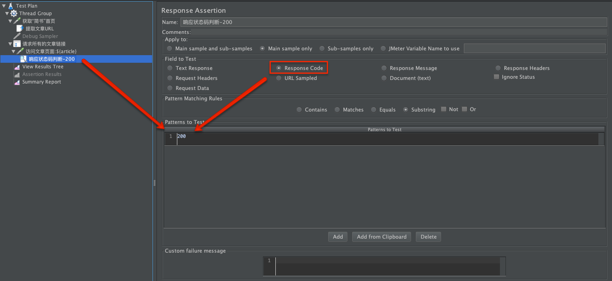
- 添加`Assertion Results`查看所有的断言结果，执行测试查看结果 
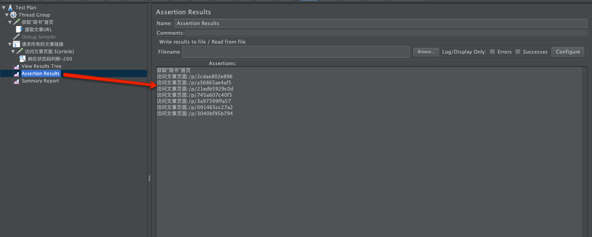

**至此，所有的调试工作已完成**

### 测试

#### 优先JMeter的配制

- 禁用`Assertion Results`
- 禁用`Result Tree`
- 添加`Summary Report`，查看测试概要结果 
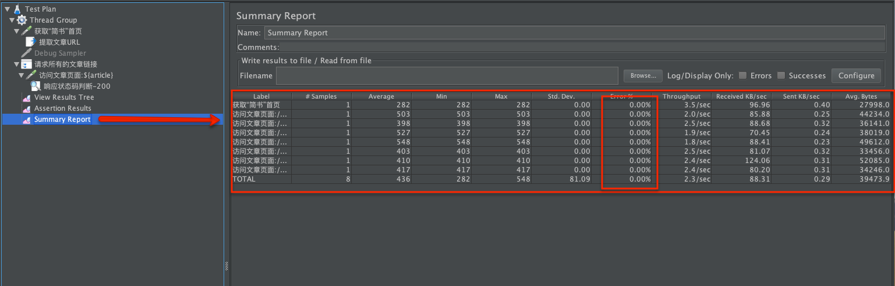

#### 执行压力测试

- 设置`Thread Group`中的`Number of Thread(users)`为1，并发为1，查看测试结果: 最小的292至最大的697，单位: 毫秒。`错误率`为0 
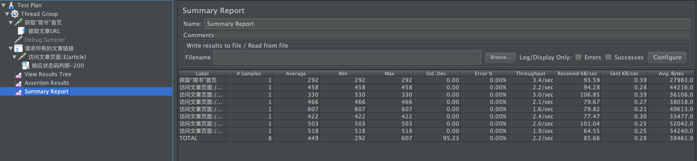
- 调整并发为10时，查看测试结果: 最小243至最大703，单位: 毫秒。`错误率`为0 
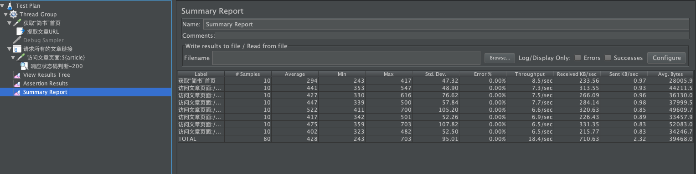
- ......
- ......
- 可以逐步将`并发`数据提升，以达到最终找出系统的性能`阀值`。性能测试`初步`结束

**说明：**
从前两次的测试结果显示，最小值没有什么变化，这种可能是因为网络原本就有波动。


### 总结

- 完整示例代码: [Sample.jxm](../src/chapter3/Sample.jmx)
- 性能测试三步走: **分析业务点->调试脚本->上测试**，上面已经完整展示。
- 通过上面几组的测试数据，可以看出，第一次的的最大值`2460`，在后面的测试过程中再没有出现过。**有可能** 是网络波动引起的
- 此项目访问的正式营运网站[简书](http://www.jianshu.com)，因此不能直接将并发量提高太多，不能出现恶意访问的情况，练手即可。**别被封IP或被被告**
- 不足

  - 当前设计的测试计划在执行过程中会有`干扰`数据: 访问首页请求，需要自行去除
  - 此测试没有`最终的报告形式`，有效且完整的报告内容在后续章节说明
