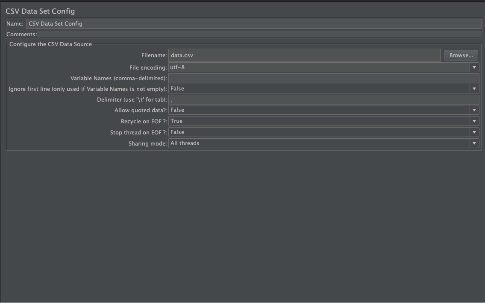
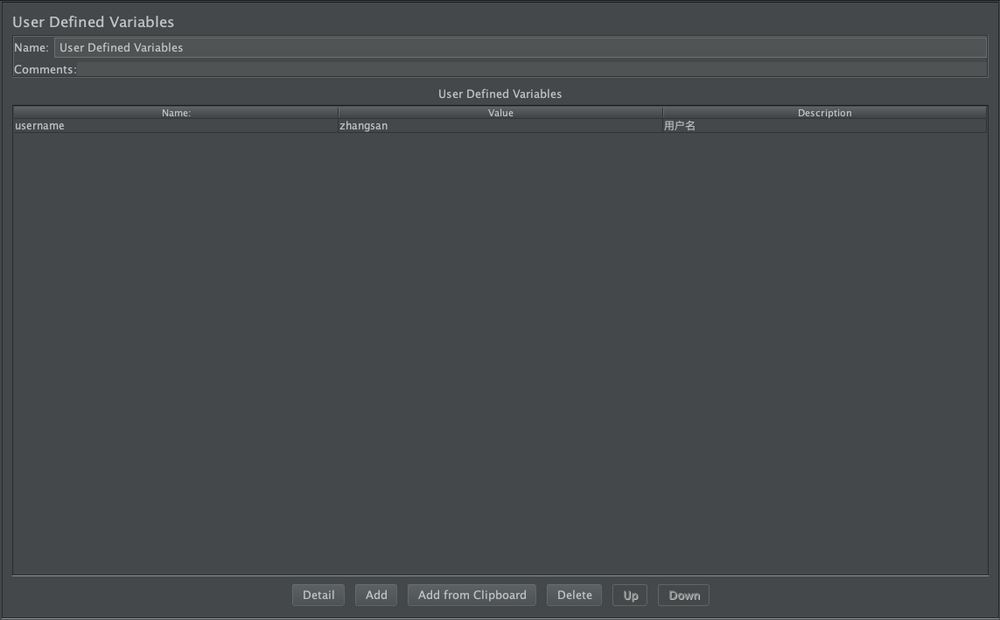
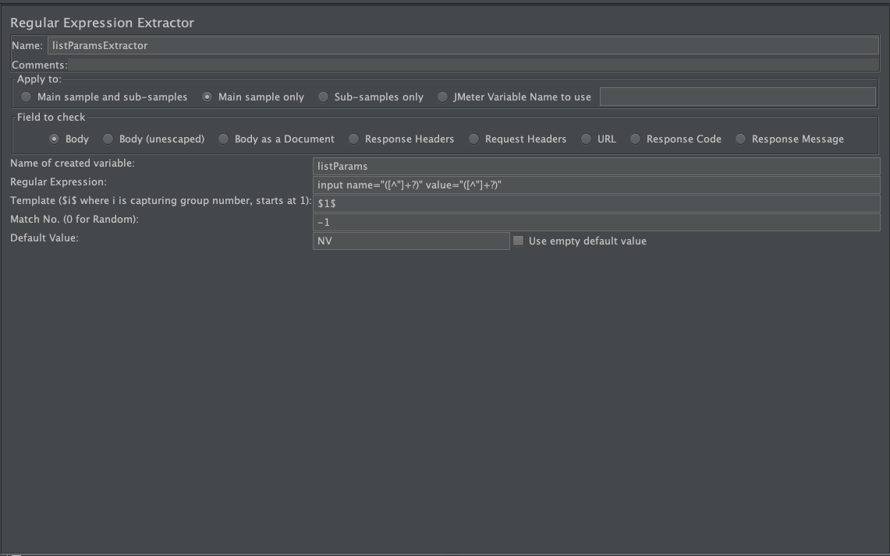

[JMeter](http://jmeter.apache.org/)使用过程中，会需要引入`外部数据`/`过程数据`/`结果数据`。以下三种技术方案将帮你实现此需求。

# CSV Data Set Config

用于配制`CSV`文件数据集。

## `CSV`文件

- `CSV`全称: `Comma-Separated Values`，逗号分隔值或字符分隔值。其文件以纯文本形式存储表格数据（数字和文本）。
- 详细的`CSV`文件说明可参考 [百度文库-CSV](http://baike.baidu.com/subview/468993/5926031.htm)

## 配制说明

- `Config the CSV Data Source`

  - `Filename`: 获取目标的`CSV`文件，**建议与测试计划jmx文件存放在同和文件夹中**
  - `File encoding`: 文件编码格式，有需求时，可配制。默认留空即可
  - `Variable Names(comma-delimited)`: 定义变量名，以逗号分隔不同的变量名。若此外不定义，则会取`CSV`文件中的首行内容为变量名。**建议此处不定义**
  - `Delimiter(use '\t' for tab)`: 使用哪种符号来分隔，默认使用`,`
  - `Allow quoted data?`: 如果设置为`True`，则在变量中可以使用`双引号`。默认为`False`
  - `Recycle on EOF?`: 在线程组运行过程中，若文件读取至最后一行后，是否`继续`读取。默认为`True`
  - `Stop thread on EOF?`: 在线程组运行过程中，若文件读取至最后一行后，是否`停止`线程。默认为`False`
  - `Sharing mode`: 读取数据的分享模式
  - `All threads`: 文件数据在所有线程中共享
  - `Current thread group`: 仅在单个`线程组`中共享
  - `Current thread`: 仅针对单个`线程`共享

- 示例参考: 仅用于说明`CSV`文件调用的使用，可在`Result Tree`中的`Request`中查看到

  - 测试计划: [CSVDataSetConfig.jmx](../src/chapter3/CSVDataSetConfig.jmx)
  - `CSV`文件: [data.csv](../src/chapter3/data.csv)

## 应用

- 并发测试中针对不同用户信息进行获取，只需要下面**3步**。

  - 先将需要测试的用户账号信息存入至`CSV`文件中
  - 在`HTTP`请求信息中将账号信息`参数化`
  - 使用[JMeter](http://jmeter.apache.org/)的`CSV Data Set Config`元素来调用`CSV`文件，并将数据传递给`HTTP`请求

- 一些初始化数据的使用，如: 特定的`定单`状态

# User Defined Variables

使用性能测试时，会需求一些提前准备的数据。如: 指定的用户名/指定的订单号。使用`User Defined Variables`可实现。

## 配制说明

- `User Defined Variables`: 存放所有的用户自定义变量数据

  - `Name`: 变量名
  - `Value`: 变量值
  - `Description`: 变量的描述信息

- `Detail`: 详情功能，点击后可**展开并修改** `Variable`的具体信息
- `Add`: 添加一条新的变量，默认内容均为空
- `Add from Clipboard`: 将**当前复制**的内容添加至`Variable`中
- `Delete`: 删除一条`Variable`记录
- `Up/Down`: 上移/下移变量的位置
- 示例参考: [UserDefinedVariables.jmx](../src/chapter3/UserDefinedVariables.jmx)

## 应用

- 自定义变量设置: 全局变量时，可使用此功能。如:用户ID/订单号

# Regular Expression Extractor

使用`正则表达式`提取`数据`，并在[JMeter](http://jmeter.apache.org/)中使用

## 配制说明

- `Apply to`: 需要匹配的样例应用范围

  - `Main sample and sub-samples`: 主样例和子样例
  - `Main sample only`: 主样例
  - `Sub-samples only`: 仅子样例
  - `JMeter Variable`: [JMeter](http://jmeter.apache.org/)变量

- `Field to check`: 检查的区域

  - `Body`: 返回的数据体，如: 页面的内容(除消息头)。默认使用
  - `Body(unescaped)`: 所有的`HTML`均被替换。**慎用**
  - `Body as a Document`: 像文档的数据体
  - `Response Headers`: 返回的消息头
  - `Request Headers`: 请求的消息头
  - `URL`: URL请求信息，如: www.baidu.com
  - `Response Code`: 返回的状态码
  - `Response Message`: 返回信息

- `Reference Name`: 抽取出来的变量名
- `Regular Expression`: 匹配的`正则表达式`
- `Template`: 匹配模板，从匹配结果中创建一组字符串。若`Regular Expression`中会抽取多个结果，则`$1$`是第一组数据/`$2$`表示第二组数据。`$0$`表示整个结果
- `Match No.(0 for Random)`:使用匹配的第`No`结果，0表示随机，负数用于与`ForEach Controller`配合使用
- `Default Value`: 默认值，如果没有匹配出结果，则使用的默认值。

  - `Use empty default value`: 勾选后，则使用`空`为默认值

- 示例代码: [RegularExpressionExtractor.jmx](../src/chapter3/RegularExpressionExtractor.jmx)

## 应用

- 对于返回结果中数据提取，如: 从第一个请求中获取`用户信息`，再从第二个请求中使用`用户信息`
- 配合`ForEach Controller`进行对应结果的场景处理，如: 从第一个请求中获取一组数据，再`依次`结合这一组数据获取另外的数据
