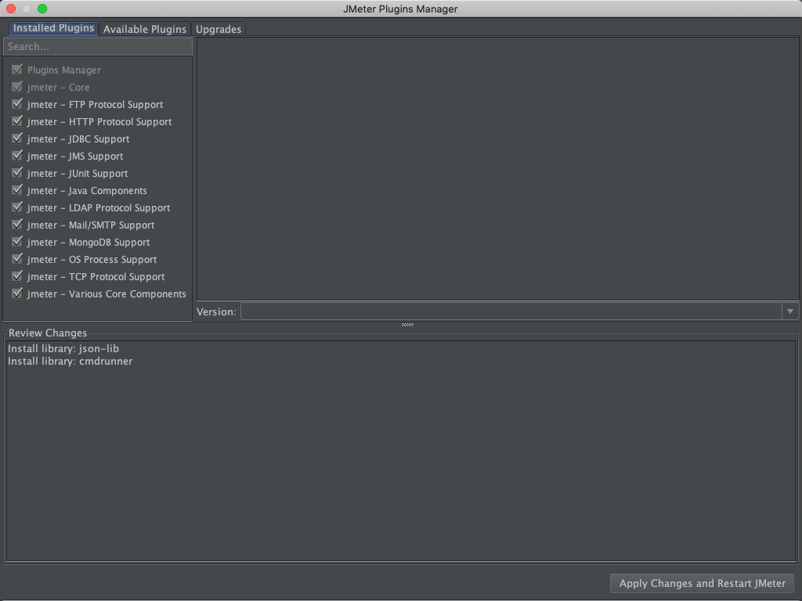
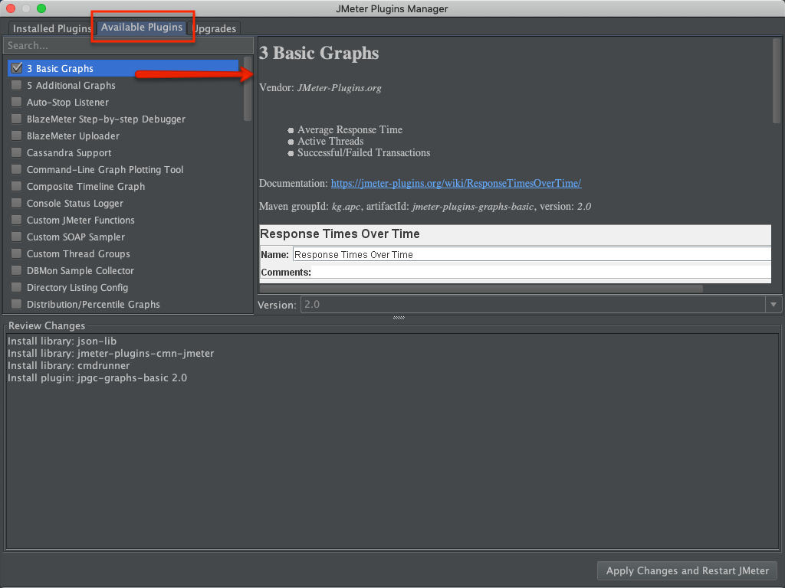
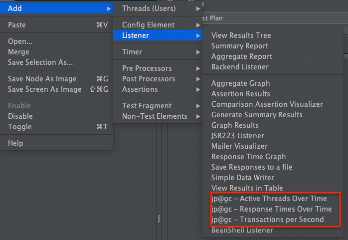
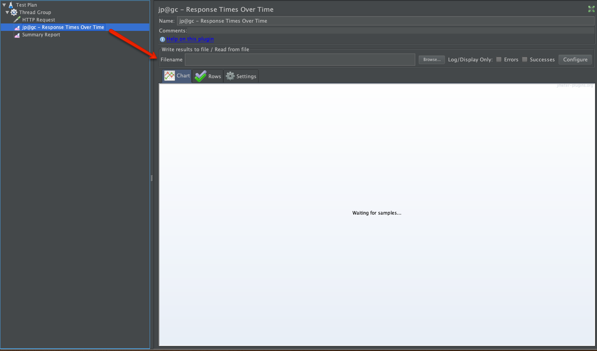
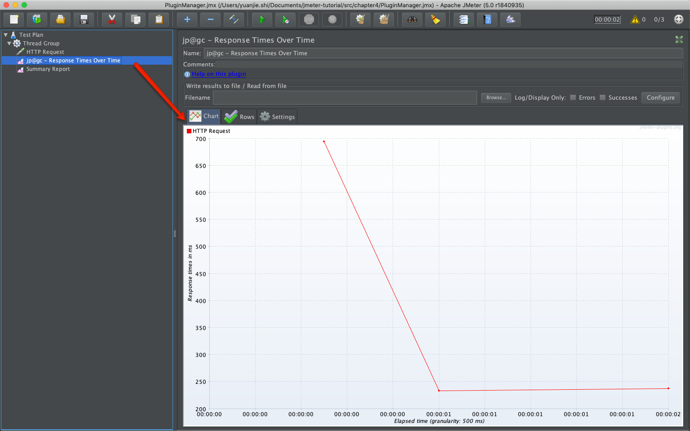
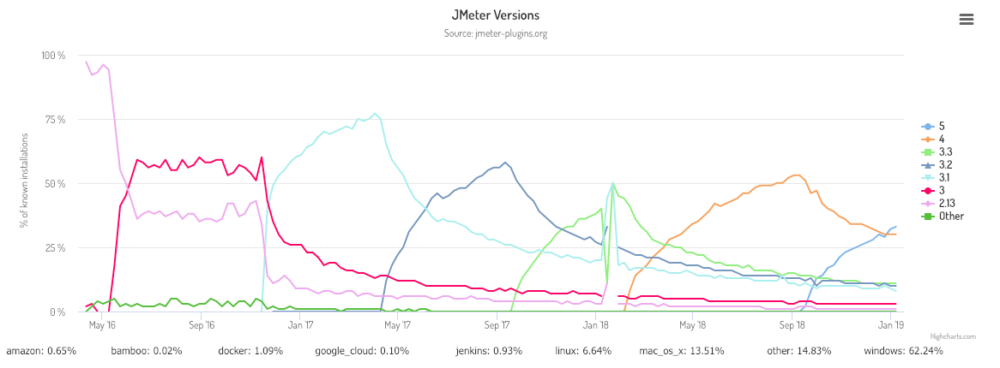
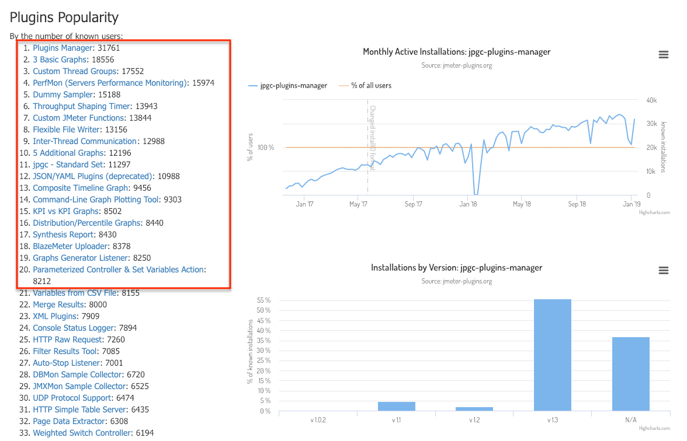

# 扩展插件

[JMeter](http://jmeter.apache.org/)虽然自带了一些丰富的功能，但在使用过程中，我们仍会有一些**其它**的需求。如: 每个响应时间趋势图/服务器性能监视。本章内容主要围绕<https://jmeter-plugins.org/>官网的插件使用。

> 很多JMeter插件生成的结果，可直接用于性能测试报告中。如: Response Times Over Time

## 安装`Plugins-manager`

- 下载`Plugins-manager`，地址: [https://jmeter-plugins.org/get/](https://jmeter-plugins.org/get/)。
- 将下载的文件`jmeter-plugins-manager-1.3.jar`，当前最新版本为`1.3`。复制到JMeter的文件夹`/lib/ext`
- 重启JMeter，在菜单选项`Options`最下方会多出一个功能`Plugins Manager`
- 打开`Plugins Manager`会打开一个弹出框 

- 界面显示成功，则`Plugins-manager`安装成功

## 使用`Plugins-manager`安装`扩展插件`

点击对应的插件名，可查看具体的插件`使用说明`。使用[3 Basic Graphs](https://jmeter-plugins.org/wiki/ResponseTimesOverTime/)插件进行举例说明。

- 安装插件[3 Basic Graphs](https://jmeter-plugins.org/wiki/ResponseTimesOverTime/)

  - 进入`Available Plugins`勾选`3 Basic Graphs` 
  
  - 选择`Apply Changes and Restart JMeter`
  - 此时JMeter会通过插件管理`PluginsManager`去下载`3 Basic Graphs`，完成后自动重启JMeter
  - 在`Listener`中会多出`3`个可选项: 
    - `Active Threads Over Time` 
    - `Response Times Over Time` 
    - `Transactions per Second`
      
    
  - 插件安装完成

- 使用插件

  - 添加`Response Times Over Time` 
  
  - 执行测试，查看结果 
  

- 分析`Response Times Over Time`

  - 此插件主要用于展示测试过程中的`Response Time`，并绘制成时序图
- 完整脚本：[PluginManager.jmx](../src/chapter4/PluginManager.jmx)

## 官方插件

JMeter-Plugins官方给出了使用插件对应的JMeter版本及使用频率的插件列表。参考<https://jmeter-plugins.org/stats/>

- JMeter版本的使用情况 

  - 可以看出[JMeter5.0](http://jmeter.apache.org/changes.html)发布后，使用的人数在`直线上升`

- 各插件的使用情况 

- [插件分类](https://jmeter-plugins.org/wiki/Start/)

  - 图形类
  - 线程组
  - 计时器
  - 监听器
  - 工具类
  - 功能
  - 逻辑控制
  - 样例
  - 配制项
  - 前置操作
  - 后置操作
  - 断言

> 依据项目的需求找出`合适的插件`，在自己的项目中去尝试吧。
