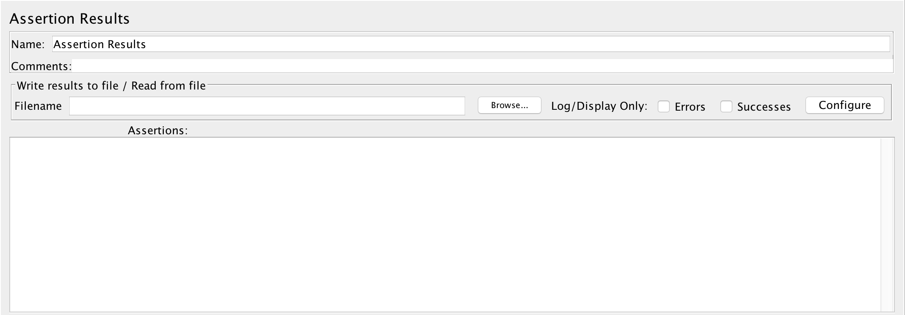
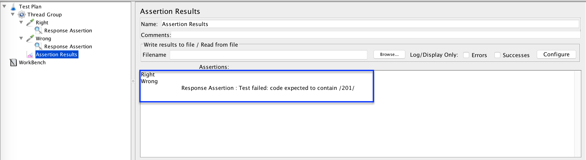

# 断言结果详细分析

`断言`经常被用于测试计划调试过程中，针对`断言结果`的分析可加倍测试调试效率。

## `Assertion Results`

### 配制说明

* `Write results to file / Read from file`: 保存结果或读取结果
  * `Filename`: 文件名，`Browser`用于选择`目标文件`
  * `Log/Display Only`: 日志/显示部分
    * `Errors`: 仅错误
    * `Successes`: 仅成功
  * `Configure`: 自定义部分，与其它结果可选项一致
* `Assertions`: 断言结果列表

### 实例

* 访问[http://www.jianshu.com/](http://www.jianshu.com/)会返回状态码`200`
* 针对此`URL`请求，进行两次请求，且使用不同的状态码来`断言`: 200/201

* 执行测试，查看结果

* 在断言结果列表中: `Right`请求正常`; `Wrong`请求下面的`Response Assertion`会断言`失败`，并显示`Response Assertion: Test failed: code expected to contain /201/ `
* 完整示例参考: [AssertionResultsDetails.jmx](../src/chapter4/AssertionResultsDetails.jmx)

### 应用

* 使用`Assertion`可以验证测试结果的`正确性`
* 使用`Assertion Results`可以查看在整个测试过程中的所有`断言`结果，并回显具体的错误: **哪些在执行过程中出错，具体的错误内容是什么**
