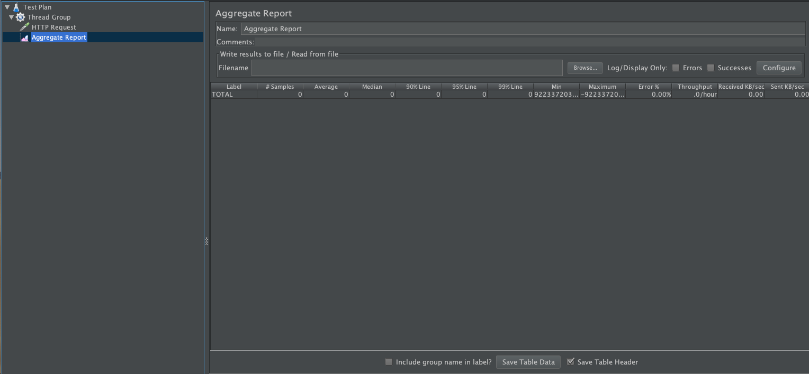
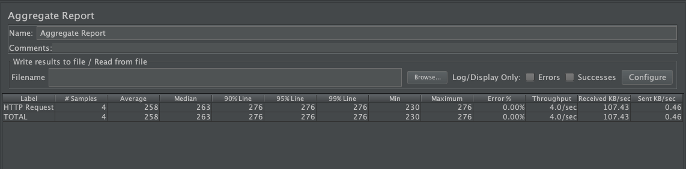

# 结果详细分析

善于使用[JMeter](http://jmeter.apache.org/)的结果分析报告功能，对于`性能测试`有很大的帮助。如: **并发数据/响应数据/错误率**

常用的报告有两种`Summary Report` `Aggregate Report`，`Summary Report`在第二章的[结果分析](../chapter2/结果分析.md)中已讲过。

## Aggregate Report

### 配制说明

- `Write results to file / Read from file`: 写结果到文件或读取文件内容

  - `File`: 需要加载的文件
  - `Log/Display Only`

    - `Errors`: 仅显示错误
    - `Successes`: 仅显示成功的部分
    - `Configure`: 需要配制保存的字段

- `结果展示列表`

  - `Label`: 样例名
  - `# Samples`: 执行样例数
  - `Average`: 平均时间，单位: 毫秒
  - `Median`: `50％`用户的响应时间，单位: 毫秒
  - `90% Line`: `90％`用户的响应时间，单位: 毫秒
  - `95% Line`: `95％`用户的响应时间，单位: 毫秒
  - `99% Line`: `99％`用户的响应时间，单位: 毫秒
  - `Min`: 最小响应时间，单位: 毫秒
  - `Max`: 最大响应时间，单位: 毫秒
  - `Error`: 错误率
  - `Throughput`: 吞吐量，默认情况下表示每秒完成的请求数(Request per Second)，单位: 秒
  - `KB/sec`: 每秒`千字节`

- `Include group name in label`: `label`中显示线程组名

- `Save Table Data`: 保存`结果展示列表`中数据

- `Save Table Header`: 是否保存`列表头`

- 示例结果 

- 示例代码: [AggregateReport.jmx](../src/chapter4/AggregateReport.jmx)

### 应用

- 测试结果数据，**大部分** 可直接体现在`测试报告`中

## `Summary Report` VS `Aggregate Report`

### 区别对比

属性         | SummaryReport | AggregateReport
:----------: | :-----------: | :-------------:
Label      |       √       |        √
Samples  |       √       |        √
Average    |       √       |        √
Min        |       √       |        √
Max        |       √       |        √
Std. DEV.  |       √       |        ×
Error %    |       √       |        √
Throughput |       √       |        √
KB/sec     |       √       |        √
Avg. Bytes |       √       |        ×
Median     |       ×       |        √
90% Line   |       ×       |        √
95% Line   |       ×       |        √
99% Line   |       ×       |        √

### 应用区别

- `Summary Report`数据更侧重于在性能优化过程中使用，`给团队内部看`
- `Aggregate Report`数据侧重于在产出最终的性能报告，`给领导看`
