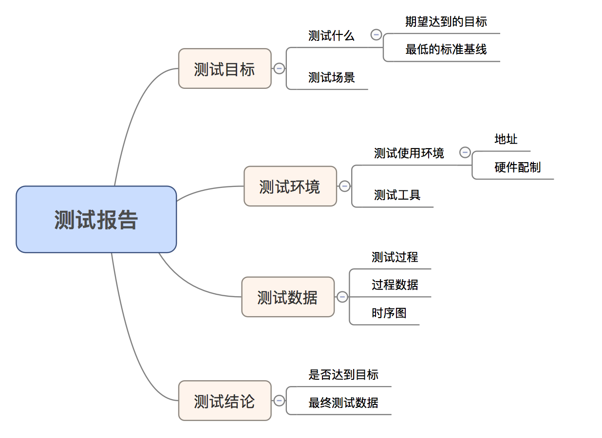

# 测试报告

如果你已经看到这里，相信对性能测试已经有了一个`完整`的认识了。那么接下来，你差的就是一个有效的`测试报告`。

## 测试报告内容

### 测试目标

- 明确测试目标是什么，要达到什么样的标准

  - 预期的测试数据`指标`

  - 可接受的最低基线

- 测试场景

  - 明确哪些场景是进行测试的，有必要时，可说明为什么要选择`此场景`及对项目的影响

### 测试环境

- 测试使用的环境地址: 安装包/URL地址

- 测试使用的硬件配制

- 测试工具的选取

### 测试数据

- 测试过程，进行的测试轮次/时间。也可直接给出`最终`的性能测试数据

  - 每个场景的测试过程数据

  - 数据是否需要更加完善的`时序图`来展示

### 测试结论

- 是否达到了`预期`的指标

- 最终的`数据概述`
